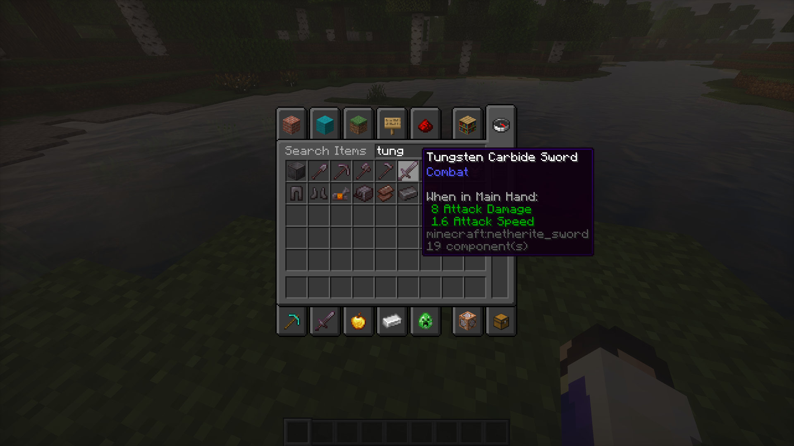
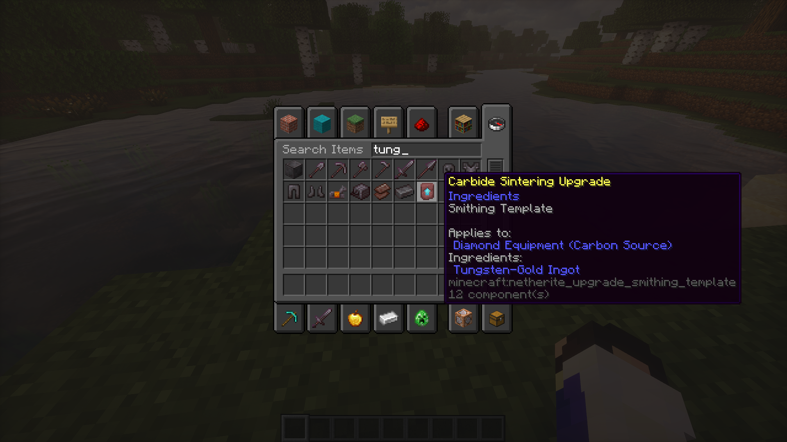
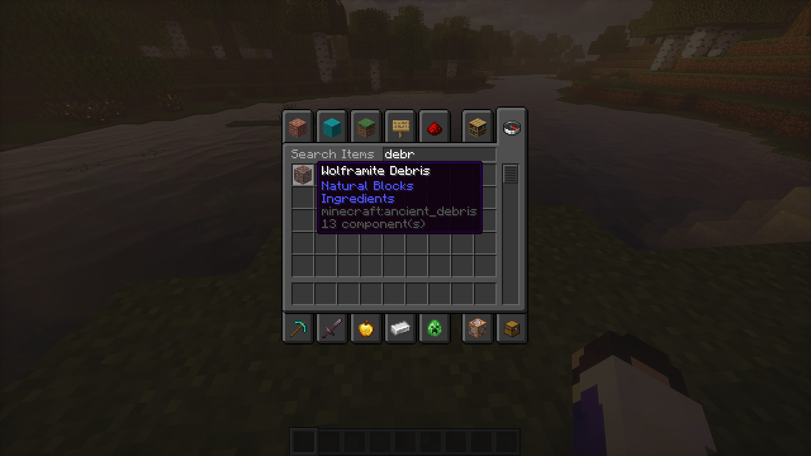
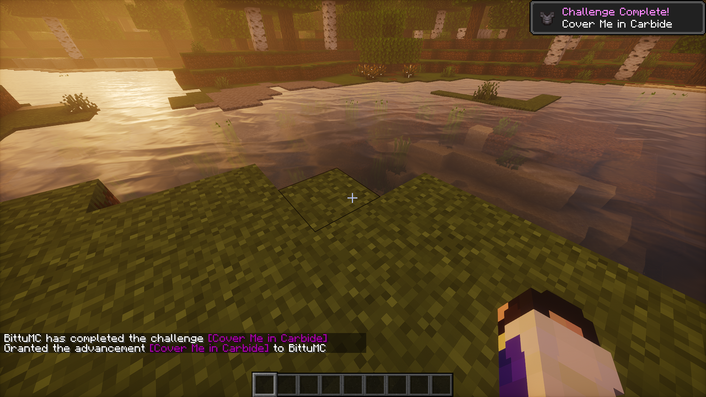

# Tungsten Carbide Pack (Minecraft Java Edition)

A Minecraft resource pack applying scientifically plausible metallurgy to Netherite, inspired by real-world materials science and the YouTube analysis: [**"Jeweller reviews Minecraft netherite"**](https://www.youtube.com/shorts/jQjj2ra1NJ0).

  

  
  
  

---

## Inspiration and Metallurgy Theory

> *"As a jeweler, I think netherite is Minecraft's coolest bit of semi-real metallurgy because if you treat the crafting recipe like a real-world material process, it becomes weirdly similar to materials I actually use daily... Ancient debris behaves like some kind of refractory metal [tungsten]... your diamond tool supplies the carbon, and the gold acts like the tougher metallic binder."*
> — [**Watch the YouTube Short**](https://www.youtube.com/shorts/jQjj2ra1NJ0)

In materials science and precision tooling, **Tungsten Carbide ($\text{WC}$)** is an ultra-hard cermet (ceramic-metallic composite). The in-game Netherite workflow matches this process:

| Minecraft In-Game Asset | Metallurgical Equivalent | Scientific Role |
| :--- | :--- | :--- |
| **Ancient Debris** | **Wolframite Debris** | Refractory tungsten source ($T_m \approx 3{,}422^\circ\text{C}$), exceptionally heat-resistant. |
| **Netherite Scrap** | **Refined Tungsten Scrap** | Purified elemental tungsten ($\text{W}$) recovered after high-temperature smelting. |
| **Gold Ingot** | **Ductile Metallic Binder** | Soft, highly ductile metal that prevents catastrophic brittle fracture in the composite matrix. |
| **Netherite Ingot** | **Tungsten-Gold Ingot** | Precursor alloy ingot of tungsten sintered with the ductile gold binder. |
| **Diamond Equipment** | **Carbon Substrate ($\text{C}$)** | Diamond is pure elemental carbon, acting as the carburization reactant. |
| **Smithing Upgrade** | **Carbide Sintering Upgrade** | Solid-state carburization & sintering: tungsten reacts with diamond carbon to form **Tungsten Carbide ($\text{WC}$)**. |
| **Netherite Gear** | **Tungsten Carbide Equipment** | Sintered $\text{WC-Au}$ cermet tools and armor. |

---

## In-Game Showcase

  
  

  
  

---

## Installation

1. Click the **Download Resource Pack** button above or visit the [Releases](https://github.com/Bittu5134/TungstenCarbidePack/releases) page.
2. Place the downloaded `.zip` file into your `.minecraft/resourcepacks/` directory.
3. In Minecraft, navigate to **Options** → **Resource Packs...**, activate **Tungsten Carbide Pack**, and click **Done**.
